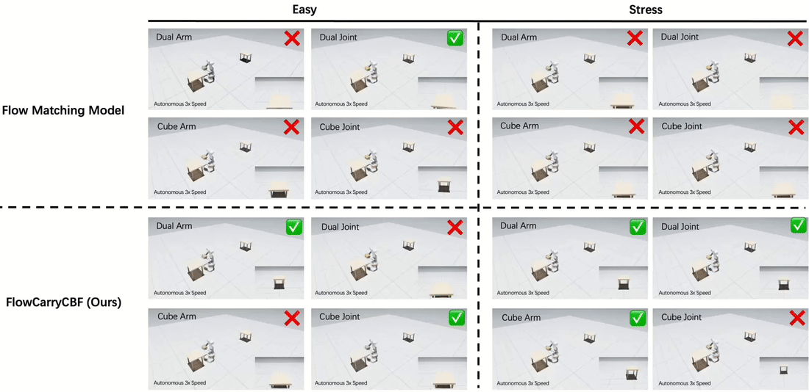

<div align="right">
  🌐 <a href="./README.md">English</a>
  |
  <strong>简体中文</strong></a>
</div>

<h1 align="center">FlowCarryCBF</h1>
<h2 align="center">基于流匹配与预测式全身 CBF 的安全双臂操作</h2>

## 📖 项目简介

**FlowCarryCBF** 是一个面向动态环境双臂操作的视觉框架。该框架结合条件流匹配进行动作生成，并使用预测式全身 CBF-QP，实现安全且具备障碍感知能力的闭环执行。

## 🖥️ 演示

<p align="center">
  
</p>

## 🛠️ 安装

### 1. 快速安装

```bash
cd FlowCarryCBF
conda env create -f environment.yml

conda activate flowcarrycbf
pip install -e . --no-deps
```

### 2. 手动安装（可选）

```bash
conda create -n flowcarrycbf python=3.11 pinocchio=2.7.0 -c conda-forge
conda activate flowcarrycbf

pip install torch==2.7.0 torchvision==0.22.0 \
  --index-url https://download.pytorch.org/whl/cu128
pip install "isaacsim[all,extscache]==5.1.0.0" \
  --extra-index-url https://pypi.nvidia.com
pip install -r requirements.txt
pip install -e . --no-deps

pip install "git+https://github.com/iROSA-lab/mushroom-rl.git@20e6ca13f367c9f751dbb0c593a05b80d00b5fe7"
pip install "git+https://github.com/mbreyer/robot_helpers.git@ba6e7afeda5e74afdf509384d4f3aad895396b19"

# 首次启动 Isaac Sim 前接受 NVIDIA EULA：
export OMNI_KIT_ACCEPT_EULA=YES
```

## 🚀 快速开始

### 1. 🕹️ 数据采集

采集器首先预筛选可复现的 Oracle 规划，随后仅记录在 PhysX 回放中成功的轨迹：

```bash
bash scripts/collect_data.sh \
  --episodes 100 \
  --template-ids dual_arm_easy,dual_joint_easy,cube_arm_easy,cube_joint_easy \
  --output data/raw_4tasks
```

若要恢复中断的采集，请使用相同命令并添加 `--resume`。

### 2. 🗂️ 数据预处理

```bash
bash scripts/convert_data.sh \
  --source data/raw_4tasks \
  --output data/processed_4tasks.zarr \
  --episodes 100
```

### 3. 🚆 训练

```bash
bash scripts/train_policy.sh \
  --data data/processed_4tasks.zarr \
  --output checkpoints/flow_4tasks.pt
```

### 4. 🦾 评测

```bash
bash scripts/eval_policy.sh \
  --model checkpoints/flow_4tasks.pt \
  --category all \
  --runs 1 \
  --seed 0 \
  --methods flow,flow_cbf \
  --workers 4 \
  --output-dir outputs/eval_all_tasks
```

- `--category all` 评测全部 12 个模板：4 个 `easy`、4 个 `stress` 和 4 个 `hard`。
- `--runs 1` 为每个选定模板运行一个确定性 seed。
- `--workers 4` 使用 4 个独立 Isaac Sim 进程并行评测（默认值为 `1`；资源有限时请调小）。
- 添加 `--record-video` 可保存每个回合的第一视角和全景视频。

我们在 Hugging Face 上提供了[模型下载](https://huggingface.co/yechen056/flow_cbf/resolve/main/flow_4tasks.pt?download=true)：
> 💡 请将下载的模型放置到 `checkpoints/` 目录。

本项目包含四类任务，并设置了 `Easy`、`Stress` 和 `Hard` 三个难度等级。

| 类别 | 动态任务 | 动态–静态混合任务 |
| :--- | :--- | :--- |
| Easy | `dual_arm_easy`、`dual_joint_easy` | `cube_arm_easy`、`cube_joint_easy` |
| Stress | `dual_arm_stress`、`dual_joint_stress` | `cube_arm_stress`、`cube_joint_stress` |
| Hard | `dual_arm_hard`、`dual_joint_hard` | `cube_arm_hard`、`cube_joint_hard` |

## 📦 数据格式

### TIAGo 原始 HDF5

| 字段 | 数据类型 | 形状 |
| :--- | :--- | :--- |
| `rgb` | `uint8` | `(T, 2, 480, 640, 3)` |
| `proprio` | `float32` | `(T, 17)` |
| `actions` | `float32` | `(T, 17)` |

### 训练 Zarr

| 字段 | 数据类型 | 形状 |
| :--- | :--- | :--- |
| `rgb` | `uint8` | `(N, 2, 240, 320, 3)` |
| `proprio` | `float32` | `(N, 17)` |
| `actions` | `float32` | `(N, 17)` |
| `episode_ends` | `int64` | `(E,)` |

## 🗂️ 仓库结构

```text
FlowCarryCBF/
├── flowcarrycbf/
│   ├── cli/                         # 数据采集、转换、训练和评测
│   ├── config/                      # 仿真运行时配置
│   ├── envs/tasks/                  # Isaac Sim TIAGo 搬运任务
│   ├── policies/flowcarry_cbf/      # Flow 策略、感知、运动学和 CBF-QP
│   └── robots/                      # 机器人处理器和资产
├── scripts/                         # 统一 Shell 入口
├── environment.yml
├── requirements.txt
└── pyproject.toml
```

# 📜 许可证

本项目基于 [MIT License](LICENSE.txt) 发布。

# 🙏 致谢

本项目基于以下优秀的开源项目：[Flow Matching Policy](https://hri-eu.github.io/flow-matching-policy/)、[SafeFlowMPC](https://github.com/TU-Wien-ACIN-CDS/SafeFlowMPC)、[SafeFlowMatcher](https://github.com/takahashi-seiryu/SafeFlowMatcher)、[UR5e-DP-Family](https://github.com/yechen056/UR5e-DP-Family) 和 [ActPerMoMa](https://github.com/pearl-robot-lab/ActPerMoMa)。感谢这些项目的作者和维护者所作出的贡献。
